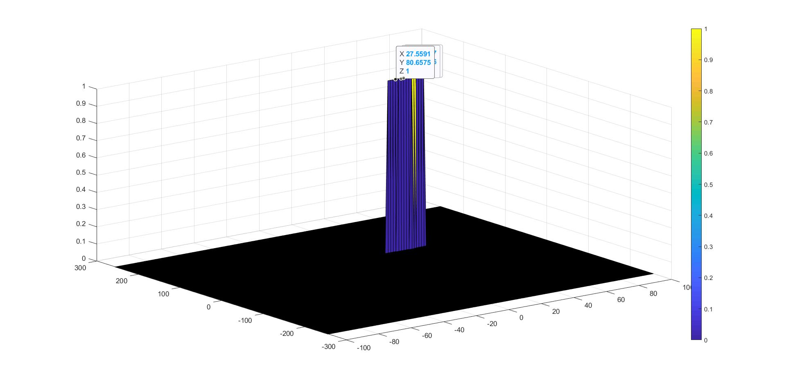

# Radar-based-Target-Generation-Detection

FMCW - Frequency Modulated Continous Wave

## Project Objective 

* To design a FMCW waveform and model a Signal propagation for a moving target scenario.
* To calculate the beat signal based on modeled transmitted and received signals.
* Implement 1D FFT for target range detection and 2D FFT to generate 'Range Doppler Map' for finding target's range, velocity.
* Implement 2D CFAR (Constant False Alarm Rate) on the Range Doppler Map to suppress the noise.

The initial position of the target is set to 80m and the initial velocity is set to 35m/s.

## My Results 

* Target Range detection from Fast Fourier Transform 1D and the detection is around 80 close to the initial position of the target

* The Range Doppler Response obtained here

*The Constant False Alarm Rate Implemented here

